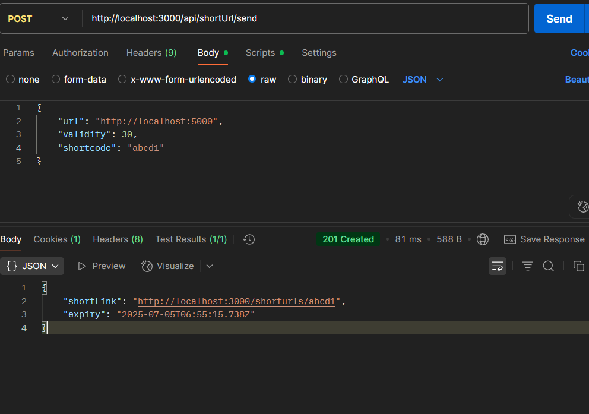

sample .env

PORT = 3000
JWT_SECRET_KEY = "kdkfjajeowrjfndcmoqaiqwejrfkjadsmnfmasckal"

Here i have implemented the api using jsonwebtoken to check the validity and uuid to create the shortUrl if not given by the user.

to run:
   npm run dev